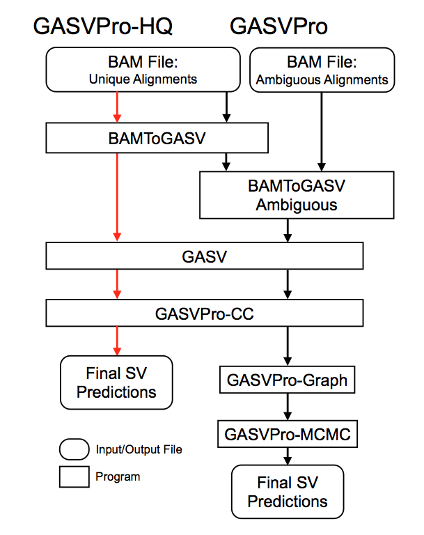
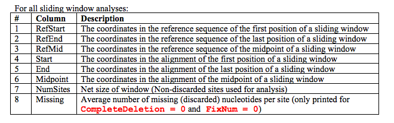
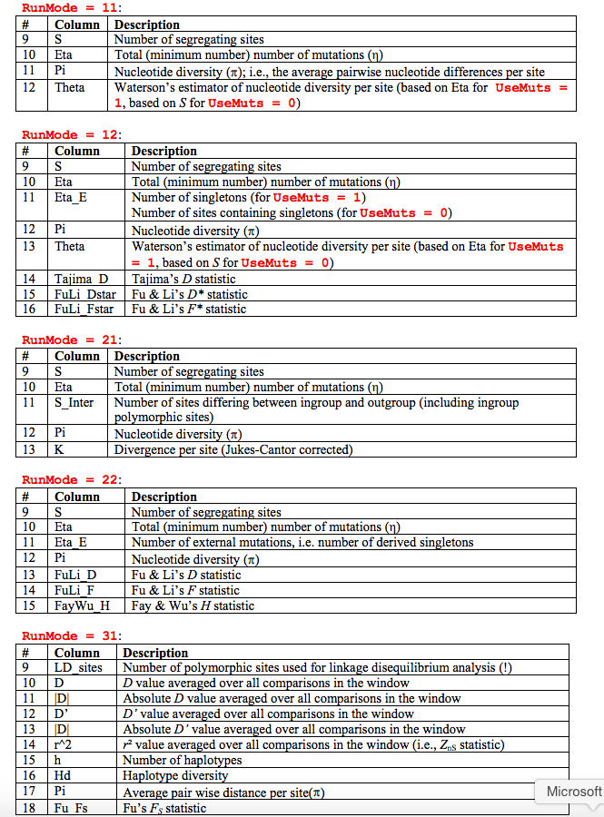

SOMMAIRE

**1.	BWA			**[http://bio-bwa.sourceforge.net](http://bio-bwa.sourceforge.net/)

**2.	SVDetect		**[http://svdetect.sourceforge.net](http://svdetect.sourceforge.net/)

**3.	SAMtools 		**[http://samtools.sourceforge.net](http://samtools.sourceforge.net/) 

**4. 	DELLY			**[http://www.embl.de/~rausch/delly.html](http://www.embl.de/~rausch/delly.html)

**5.	MUMmer 		**[http://mummer.sourceforge.net](http://mummer.sourceforge.net/)

**6.	GASVPro		**[https://code.google.com/p/gasv](https://code.google.com/p/gasv/)

**7.	BreakDancer		**[https://github.com/kenchen/breakdancer](https://github.com/kenchen/breakdancer)

**8.	FastX toolkit		**[http://hannonlab.cshl.edu/fastx_toolkit](http://hannonlab.cshl.edu/fastx_toolkit/)

**9.	Tophat**			[http://tophat.cbcb.umd.edu/manual.shtml](http://tophat.cbcb.umd.edu/manual.shtml)

**10.	Blast			**[http://blast.ncbi.nlm.nih.gov/Blast.cgi](http://blast.ncbi.nlm.nih.gov/Blast.cgi) 

**11.	Sequence server	**[http://www.sequenceserver.com](http://www.sequenceserver.com/)

**12.	Cutadapt		**[https://code.google.com/p/cutadapt](https://code.google.com/p/cutadapt/)

**13.	Cufflinks		**[http://cufflinks.cbcb.umd.edu](http://cufflinks.cbcb.umd.edu/)

	**14.	RATT			**[http://ratt.sourceforge.net/](http://ratt.sourceforge.net/)

**	15.	LDhat			**[http://ldhat.sourceforge.net/](http://ldhat.sourceforge.net/) 

**	16.	SIFT			**[http://sift.jcvi.org/](http://sift.jcvi.org/) 

**17. 	Variscan		**[http://www.ub.edu/softevol/variscan/](http://www.ub.edu/softevol/variscan/) 

**	18. 	Cluster 3.0		**[http://bonsai.hgc.jp/~mdehoon/software/cluster/software](http://bonsai.hgc.jp/~mdehoon/software/cluster/software.htm) 

**	19. 	Java TreeView	**[http://jtreeview.sourceforge.net/](http://jtreeview.sourceforge.net/) 

**	20. 	MeV			**[http://www.tm4.org/mev.html](http://www.tm4.org/mev.html) 

	**21.	Plink			**[http://pngu.mgh.harvard.edu/~purcell/plink/plink2.shtml](http://pngu.mgh.harvard.edu/~purcell/plink/plink2.shtml) 

**	22.	Phase			**[http://stephenslab.uchicago.edu/software.html](http://stephenslab.uchicago.edu/software.html) 

**23.	Germline		**http://www.cs.columbia.edu/~gusev/germline/

**24.	PAML			**http://abacus.gene.ucl.ac.uk/software/paml.html

**25.	SequenceLDhot	**[http://www.maths.lancs.ac.uk/~fearnhea/Hotspot/](http://www.maths.lancs.ac.uk/~fearnhea/Hotspot/)  

**26.	IGV			**[https://www.broadinstitute.org/igv/](https://www.broadinstitute.org/igv/)

**27.	snpEff			**[http://snpeff.sourceforge.net/](http://snpeff.sourceforge.net/)

**28.	ShortStack		**

**29.	mirDeep2		**

**30.	PAREsnip**

**31.	CleaveLand2.pl	**

**32.	Sparta.py**

**33.	SPAdes		**[http://spades.bioinf.spbau.ru/release3.9.0/](http://spades.bioinf.spbau.ru/release3.9.0/)

34.	SRA-toolkit	

	

 

  

		

**	**

# 1. BWA – Burrows Wheeler Aligner

 

BWA is a software package for mapping low-divergent sequences against a large reference genome, such as the human genome. It consists of three algorithms: BWA-backtrack, BWA-SW and BWA-MEM. The first algorithm is designed for Illumina sequence reads up to 100bp, while the rest two for longer sequences ranged from 70bp to 1Mbp. BWA-MEM and BWA-SW share similar features such as long-read support and split alignment, but BWA-MEM, which is the latest, is generally recommended for high-quality queries as it is faster and more accurate. BWA-MEM also has better performance than BWA-backtrack for 70-100bp Illumina reads.

Website	:	[http://bio-bwa.sourceforge.net](http://bio-bwa.sourceforge.net/)

1st publication	:	[http://www.ncbi.nlm.nih.gov/pubmed/19451168](http://www.ncbi.nlm.nih.gov/pubmed/19451168) 

 

**BWA Output**

 

The raw output is in .SAM format, and has the following columns:

 

** ****Column  		Description**

1  QNAME        	Query (pair) NAME

2  FLAG           	bitwise FLAG

3  RNAME          	Reference sequence NAME

4  POS	        		1-based leftmost POSition/coordinate of clipped sequence

5  MAPQ           	MAPping Quality (Phred-scaled)

6  CIGAR          	extended CIGAR string

7  MRNM           	Mate Reference sequence NaMe ('=' if same as RNAME)

8  MPOS           	1-based Mate POSition

9  ISIZE          		Inferred insert SIZE

10 SEQ            	query SEQuence on the same strand as the reference

11 QUAL           	query QUALity (ASCII-33 gives the Phred base quality)

12 OPT            	variable OPTional fields in the format TAG:VTYPE:VALU

 

The flags codes explained:

 

<table>
  <tr>
    <td>Flag</td>
    <td>Chr</td>
    <td>Description</td>
  </tr>
  <tr>
    <td>0x0001</td>
    <td>p</td>
    <td>the read is paired in sequencing</td>
  </tr>
  <tr>
    <td>0x0002</td>
    <td>P</td>
    <td>the read is mapped in a proper pair</td>
  </tr>
  <tr>
    <td>0x0004</td>
    <td>u</td>
    <td>the query sequence itself is unmapped</td>
  </tr>
  <tr>
    <td>0x0008</td>
    <td>U</td>
    <td>the mate is unmapped</td>
  </tr>
  <tr>
    <td>0x0010</td>
    <td>r</td>
    <td>strand of the query (1 for reverse)</td>
  </tr>
  <tr>
    <td>0x0020</td>
    <td>R</td>
    <td>strand of the mate</td>
  </tr>
  <tr>
    <td>0x0040</td>
    <td>1</td>
    <td>the read is the first read in a pair</td>
  </tr>
  <tr>
    <td>0x0080</td>
    <td>2</td>
    <td>the read is the second read in a pair</td>
  </tr>
  <tr>
    <td>0x0100</td>
    <td>s</td>
    <td>the alignment is not primary</td>
  </tr>
  <tr>
    <td>0x0200</td>
    <td>f</td>
    <td>the read fails platform/vendor quality checks</td>
  </tr>
  <tr>
    <td>0x0400</td>
    <td>d</td>
    <td>the read is either a PCR or an optical duplicate</td>
  </tr>
</table>

So an output, looks like this:

QNAME FLAG	RNAME   POS 	MAPQ	CIAGR   MRNM    MPOS	ISIZE   SEQ 	QUAL	OPT

HWI-EAS91_1_30788AAXX:1:1:1761:343	4   	*   	0  	 0   	*   	*   	0   	0       AAAAAAANNAAAAAAAAAAAAAAAAAAAAAAAAAAACNNANNGAGTNGNNNNNNNGCTTCCCACAGNNCTGG        hhhhhhh;;hhhhhhhhhhh^hOhhhhghhhfhhhgh;;h;;hhhh;h;;;;;;;hhhhhhghhhh;;Phhh

HWI-EAS91_1_30788AAXX:1:1:1578:331	4   	*   	0   	0   	*   	*   	0   	0       GTATAGANNAATAAGAAAAAAAAAAATGAAGACTTTCNNANNTCTGNANNNNNNNTCTTTTTTCAGNNGTAG        hhhhhhh;;hhhhhhhhhhhhhhhhhhhhhhhhhhhh;;h;;hhhh;h;;;;;;;hhhhhhhhhhh;;hhVh

 

**About CIGAR code:**

The standard cigar code has three operations:

M : 	match or mismatch

 I  : 	insertion

D : 	deletion

The extended cigar code adds: (TODO: more explanations)

N : 	skipped bases on reference

S : 	soft clipping

H : 	hard clipping

P : 	padding

**BWA settings**

 

BWA has a lot of options implemented:

> BWA [-n maxDiff] [-o maxGapO] [-e maxGapE] [-d nDelTail] [-i nIndelEnd] [-k maxSeedDiff] [-l seedLen] [-t nThrds] [-cRN] [-M misMsc] [-O gapOsc] [-E gapEsc] [-q trimQual] <in.db.fasta> <in.query.fq> > <out.sai>

 

Here is the list with the description of each options:

 

**For aln:**

 

<table>
  <tr>
    <td>-n NUM</td>
    <td>Maximum edit distance if the value is INT, or the fraction of missing alignments given 2% uniform base error rate if FLOAT. In the latter case, the maximum edit distance is automatically chosen for different read lengths. [0.04]</td>
  </tr>
  <tr>
    <td>-o INT</td>
    <td>Maximum number of gap opens [1]</td>
  </tr>
  <tr>
    <td>-e INT</td>
    <td>Maximum number of gap extensions, -1 for k-difference mode (disallowing long gaps) [-1]</td>
  </tr>
  <tr>
    <td>-d INT</td>
    <td>Disallow a long deletion within INT bp towards the 3’-end [16]</td>
  </tr>
  <tr>
    <td>-i INT</td>
    <td>Disallow an indel within INT bp towards the ends [5]</td>
  </tr>
  <tr>
    <td>-l INT</td>
    <td>Take the first INT subsequence as seed. If INT is larger than the query sequence, seeding will be disabled. For long reads, this option is typically ranged from 25 to 35 for ‘-k 2’. [inf]</td>
  </tr>
  <tr>
    <td>-k INT</td>
    <td>Maximum edit distance in the seed [2]</td>
  </tr>
  <tr>
    <td>-t INT</td>
    <td>Number of threads (multi-threading mode) [1]</td>
  </tr>
  <tr>
    <td>-M INT</td>
    <td>Mismatch penalty. BWA will not search for suboptimal hits with a score lower than (bestScore-misMsc). [3]</td>
  </tr>
  <tr>
    <td>-O INT</td>
    <td>Gap open penalty [11]</td>
  </tr>
  <tr>
    <td>-E INT</td>
    <td>Gap extension penalty [4]</td>
  </tr>
  <tr>
    <td>-R INT</td>
    <td>Proceed with suboptimal alignments if there are no more than INT equally best hits. This option only affects paired-end mapping. Increasing this threshold helps to improve the pairing accuracy at the cost of speed, especially for short reads (~32bp).</td>
  </tr>
  <tr>
    <td>-c</td>
    <td>Reverse query but not complement it, which is required for alignment in the color space. (Disabled since 0.6.x)</td>
  </tr>
  <tr>
    <td>-N</td>
    <td>Disable iterative search. All hits with no more than maxDiff differences will be found. This mode is much slower than the default.</td>
  </tr>
  <tr>
    <td>-q INT</td>
    <td>Parameter for read trimming. BWA trims a read down to argmax_x{\sum_{i=x+1}^l(INT-q_i)} if q_l<INT where l is the original read length. [0]</td>
  </tr>
  <tr>
    <td>-I</td>
    <td>The input is in the Illumina 1.3+ read format (quality equals ASCII-64).</td>
  </tr>
  <tr>
    <td>-B INT</td>
    <td>Length of barcode starting from the 5’-end. When INT is positive, the barcode of each read will be trimmed before mapping and will be written at the BC SAM tag. For paired-end reads, the barcode from both ends are concatenated. [0]</td>
  </tr>
  <tr>
    <td>-b</td>
    <td>Specify the input read sequence file is the BAM format. For paired-end data, two ends in a pair must be grouped together and options -1 or -2 are usually applied to specify which end should be mapped. Typical command lines for mapping pair-end data in the BAM format are:
bwa aln ref.fa -b1 reads.bam > 1.sai 
bwa aln ref.fa -b2 reads.bam > 2.sai 
bwa sampe ref.fa 1.sai 2.sai reads.bam reads.bam > aln.sam</td>
  </tr>
  <tr>
    <td>-0</td>
    <td>When -b is specified, only use single-end reads in mapping.</td>
  </tr>
  <tr>
    <td>-1</td>
    <td>When -b is specified, only use the first read in a read pair in mapping (skip single-end reads and the second reads).</td>
  </tr>
  <tr>
    <td>-2</td>
    <td>When -b is specified, only use the second read in a read pair in mapping.</td>
  </tr>
</table>

 

**For samse: 	****bwa samse [-n maxOcc] <in.db.fasta> <in.sai> <in.fq> > <out.sam>**

 

-n INT          	Maximum number of alignments to output in the XA tag for reads paired

   	        	         	properly. If a read has more than INT hits, the XA tag will not be

    	        	        	written. [3]

-r STR          	Specify the read group in a format like '@RG\tID:foo\tSM:bar' [null]

 

**For sampe:	TODO: add the command**

 

-a        	INT  Maximum insert size for a read pair to be considered as being mapped properly. Since version 0.4.5, this option is only used when there

are not enough good alignment to infer the distribution of insert sizes. [500]

-n        	INT  Maximum number of alignments to output in the XA tag for reads paired properly. If a read has more than INT hits, the XA tag will not be

    	        	        	written. [3]

-N INT          	Maximum number of alignments to output in the XA tag for disconcordant

    	        	        	read pairs (excluding singletons). If a read has more than INT hits,

    	        	        	the XA tag will not be written. [10]

-o INT          	Maximum occurrences of a read for pairing. A read with more

    	        	        	occurrences will be treated as a single-end read. Reducing this

    	        	        	parameter helps faster pairing. [100000]

-r STR            Specify the read group in a format like '@RG\tID:foo\tSM:bar' [null]

For specifying the read group in samse or sampe, use the following:

 

To specify directly the read group in samse or sampe, use the following:

@RG   Read group. Unordered multiple @RG lines are allowed.
ID    Read group identifier. Each @RG line must have a unique ID. The value of
      ID is used in the RG tags of alignment records. Must be unique among all
      read groups in header section. Read group IDs may be modified when
      merging SAM files in order to handle collisions.
CN    Name of sequencing center producing the read.
DS    Description.
DT    Date the run was produced (ISO8601 date or date/time).
FO    Flow order. The array of nucleotide bases that correspond to the
      nucleotides used for each flow of each read. Multi-base flows are encoded
      in IUPAC format, and non-nucleotide flows by various other characters.
      Format : /\*|[ACMGRSVTWYHKDBN]+/
KS    The array of nucleotide bases that correspond to the key sequence of each read.
LB    Library.
PG    Programs used for processing the read group.
PI    Predicted median insert size.
PL    Platform/technology used to produce the reads. Valid values : CAPILLARY,
      LS454, ILLUMINA, SOLID, HELICOS, IONTORRENT and PACBIO.
PU    Platform unit (e.g. flowcell-barcode.lane for Illumina or slide for
      SOLiD). Unique identifier.
SM    Sample. Use pool name where a pool is being sequenced.

# 2. SVDetect

 

SVDetect is a software able to predict more or less precisely intra- and inter-chromosomal rearrangements from paired-end/mate-pair sequencing data. SVDetect is compatible with SOLiD and Illumina (>=1.3) reads.

 

website: 	[http://svdetect.sourceforge.net/Site/Home.html](http://svdetect.sourceforge.net/Site/Home.html)

publication:	[http://www.ncbi.nlm.nih.gov/pmc/articles/PMC2905550/](http://www.ncbi.nlm.nih.gov/pmc/articles/PMC2905550/)

RTFM: 	[http://svdetect.sourceforge.net/Site/Manual.html](http://svdetect.sourceforge.net/Site/Manual.html)

**Principal c****ommands:**

> SVDetect <command> -conf <config.file> [-help] [-man]

	      linking

	      filtering

             links2circos

             links2bed

             links2SV

             links2compare

             cnv

             ratio2circos

             ratio2bedgraph

**Configuration file****:**

**-- input_format (m)**

input mate file format

-text, value= eland, solid or sam/bam

**-- sv_type (o):**

type of the structural variations to detect. This parameter is used to analyse and output distinct files for intra-/inter-chromosomals SVs

-text, value= intra (for intra-chromosomal SVs only), inter (for inter-chromosomal SVs only), all (no distinction, = default)

**-- mates_orientation (m)**

expected normal strand orientation of the paired-end/mate-paired reads

(left letter=first read, right letter=second read, F=forward strand, R=reverse strand)

"RF" for Illumina mate-pairs

"RR" for SOLiD mate-pairs (F3: first read, R3: second read)

"FR" for Illumina/SOLiD paired-ends

-text, value= FF, RR, FR or RF

**-- read1_length (m)**

length of the first read in a pair (left read), in base pairs (bp)

-integer, ex: 50

**-- read2_length (m)**

length of the second read in a pair (right read), in base pairs (bp)

-integer, ex: 50

**-- mates_file (m)**

full path to the abnormal mate-pair input data file

-text, ex: /align/bowtie/sample_ab_mates.sam

**-- cmap_file (m)**

full path to the chromosome length file

-text, ex: /align/bowtie/hs18.len

**-- output_dir (o)**

output directory location

-text, ex: ./results (current directory by default)

**-- tmp_dir (o)**

output temporary location

-text, ex: ./tmp (current directory by default)

**-- num_threads (o)**

number of threads for parallel computing

-integer, ex: 8 (1 thread only by default)

**Type of structural variants detected:**

**NORMAL_SENSE** 	Correct ends orientation using <mates_orientation> as reference

**REVERSE_SENSE** 	One of the ends has an incorrect orientation

**DELETION**		Deletion (NORMAL_SENSE & mean insert size > µ+threshold*σ)

**INSERTION** 		Insertion (NORMAL_SENSE & mean insert size < µ-threshold*σ)

**INVERSION** 		Inversion (REVERSE_SENSE)

**INV_FRAGMT**		Inversion of a genomic fragment, defined by balanced signatures (BAL)

**INS_FRAGMT**	 	Insertion of a genomic fragment, defined by balanced signatures (BAL)

**INV_INS_FRAGMT**	 Inverted INS_FRAGMT (BAL)

**LARGE_DUPLI**		Large duplication

(mates orientation=FR/RF & reversed mate sense &  mean insert size > µ+threshold*σ & UNBAL) or 

(mates_orientation=FF/RR & ends order=normal/inverted & mean insert size > µ+threshold*σ & UNBAL) 

**DUPLICATION**	 	Duplication, medium size 

 (mates_orientation=FR/RF & reversed mates orientation & mean insert size < µ-threshold*σ &)

**SMALL_DUPLI** 		Small duplication (mean insert size < µ-threshold*σ & overlap between subgroups)

**INV_DUPLI** 		Inverted duplication (REVERSE_SENSE & mean insert size < µ-threshold*σ & UNBAL)

**TRANSLOC**		Translocation

**INV_TRANSLOC**		Inverted translocation

**COAMPLICON** 		Co-amplicons, two different fragments repeated in the same strand sense (BAL)

  			ex: A>B>, A>B>A>B> 

**INV_COAMPLICON**: 	Inverted co-amplicons, two different fragments repeated in the opposite strand sense 

(BAL) ex: A>B<, A>B<A>B<

**SINGLETON** 		Singleton (mean insert size < µ-threshold*σ), for Illumina mate-pairs only

**UNDEFINED**		Undefined inter/intra-chromosomal SV type

**Output file description****:**

**chr_type	SV_type	BAL_type	chromosome1	start1-end1	average_dist	chromosome2	start2-end2	nb_pairs	score_strand_filtering	score_order_filtering	score_insert_size_filtering	final_score	breakpoint1_start1-end1	breakpoint2_start2-end2**

Each line corresponds to one chromosomal SV and the format is as follows: 

1. 	Type of chromosomal rearrangement: INTRA/INTER 

2. 	Predicted type of SV

3. 	Coordinates of chromosome 1, format: chromosome:start-end

4. 	The mean separation distance is provided here if links have been filtered

according to the insert size

5. 	Balanced or unbalanced feature. See description in 2.b

6. 	Coordinates of chromosome 2, format: chromosome:start-end

7. 	Number of pairs after filtering

8. 	% of the remaining pairs after strand filtering

9. 	% of the remaining pairs after order filtering

10.	 % of the remaining pairs after insert size filtering

11. 	Score based on 8., 9. and 10. (best score=1)

12. 	Coordinates of the estimated breakpoint region in chromosome 1

13.	Coordinates of the estimated breakpoint region in chromosome 2

# 3. SAMtools

[http://biobits.org/samtools_primer.html](http://biobits.org/samtools_primer.html)

>  **samtools ****<command>**** ****[****options]**

 view        	SAM<->BAM conversion

         	 sort        	sort alignment file

         	 pileup      	generate pileup output

         	 mpileup     	multi-way pileup (for variant calling)

         	 faidx       	index/extract FASTA

         	 tview       	text alignment viewer

         	 index       	index alignment

         	 idxstats    	BAM index stats (r595 or later)

         	 fixmate     	fix mate information

         	 glfview     	print GLFv3 file

         	 flagstat    	simple stats

         	 calmd       	recalculate MD/NM tags and '=' bases

         	 merge       	merge sorted alignments

         	 rmdup       	remove PCR duplicates

         	 reheader    	replace BAM header

> **samtools view ****[****options****]**** ****<****in****.****bam****>|<****in****.****sam****>**** ****[****region1 ****[...]]**

-b       	output BAM

      -h       	print header for the SAM output

      -H       	print header only (no alignments)

      -S       	input is SAM

      -u       	uncompressed BAM output (force -b)

      -x       	output FLAG in HEX (samtools-C specific)

      -X       	output FLAG in string (samtools-C specific)

-t 		FILE list of reference names and lengths 

(force -S) [null]

      -T 		FILE reference sequence file (force -S) [null]

      -o 		FILE output file name [stdout]

      -R 		FILE list of read groups to be outputted [null]

      -f 		INT required flag, 0 for unset [0]

      -F INT    	filtering flag, 0 for unset [0]

      -q INT    	minimum mapping quality [0]

      -l STR   	only output reads in library STR [null]

      -r STR   	only output reads in read group STR [null]

      -?       	  longer help

**TO GET A SPECIFIC REGION IN A BAM:**

samtools view -H accepted_hits.bam > test.sam

samtools view accepted_hits.bam "Sakl0F:1253615-1255630" >> test.sam

samtools view -bS test.sam > test.bam

samtools index test.bam

# 4. DELLY

Website: 	[http://www.embl.de/~rausch/delly.html](http://www.embl.de/~rausch/delly.html)

Publication:	[http://www.ncbi.nlm.nih.gov/pmc/articles/PMC3436805/](http://www.ncbi.nlm.nih.gov/pmc/articles/PMC3436805/)

RTFM:  	

Deletions: **./delly**

Tandem duplications: **./duppy**

Inversions: **./invy**

Translocations: **./jumpy**

# 5. MUMmer

Website : 	[http://mummer.sourceforge.net/](http://mummer.sourceforge.net/) 

RTFM	:	[http://mummer.sourceforge.net/manual/](http://mummer.sourceforge.net/manual/)

Last paper:	[http://mummer.sourceforge.net/MUMmer3.pdf](http://mummer.sourceforge.net/MUMmer3.pdf) 

**Principal commands:**

> <command> -conf <config.file> [-help] [-man]

**   ****mapview**

**   mummer**

**   nucmer**

**   promer**

**   run-mummer1**

**   run-mummer3**

# 6. GASVPro

GASV and GASVPro were developed to identify structural variants from paired-end mapping data. The software predicts structural variation (SV) from a set of discordant mappings of paired-reads (PRs) based a geometric algorithm. GASVPro is a probabilistic algorithm consisting of two pipelines: GASVPro-HQ (HQ = HighQuality) combines depth of coverage information in order to improve specificity of GASV predictions; GASVPro in addition considers multiple possible read alignments and utilizes an MCMC algorithm to sample over the space of alignments. 

						

Site:			[https://code.google.com/p/gasv/](https://code.google.com/p/gasv/) 

Publications:		[http://bioinformatics.oxfordjournals.org/content/25/12/i222.full](http://bioinformatics.oxfordjournals.org/content/25/12/i222.full)  (2009)

			[http://genomebiology.com/content/13/3/R22](http://genomebiology.com/content/13/3/R22)  (2012)

	

**Description of the p****ipeline:**

**Description of the c****ommands:**

1. **BAMtoGASV**

**							**

> java -Xms512m -Xmx2048m -jar BAMToGASV.jar <BAMFile> [Options]

> java -Xms512m -Xmx2048m -jar /Volumes/BioSan/opt/gasv/bin/BAMToGASV.jar alnCBS6626-rel.InRef_nameSorted_fm.bam -CHROMOSOME_NAMING chrNames -GASVPRO True

**[Options] are:**

						

**-LIBRARY_SEPARATED** <String> (Default: sep)

Determines whether or not to consider multiple libraries separately

						

**sep** 	Produce a set of output files for each library. 	

**all** 	Produce a single set of output files for all libraries.

If no libary information is provided in the BAM file header, it will default to the ’all’ setting. In the case where no library info is found or ’all’ is passed as -LIBRARY SEPARATED, the word "all" is used as the LIBRARY ID in the output file names.

						

**-OUTPUT_PREFIX** <String> (Default: BAM filename) The prefix for your output files.

						

**-MAPPING_QUALITY** <Integer> (Default: 10) Mapping quality threshold for reads.

						

**-CUTOFF_LMINLMAX** <String> (Default: PCT=99%) Specifies lower and upper bounds on the fragment distribution.					

**PCT=X%** 	Take the quantile on the top/bottom X percent. 

**SD=X** 		Take the standard deviation above/below the mean. 

**EXACT=X,Y 	**Set Lmin to X and Lmax to Y.

**FILE=fname** 	File of the form ’<libname> <CUTOFF LMINLMAX>’ for using different cutoffs for individual libraries.

EXAMPLE:	library id1 EXACT=123,456

		library id2 SD=3 library id3 PCT=90%

In the case that the computed Lmax is smaller than twice the read length (which is the minimum fragment length), Lmax is reset to be twice the read length.

						

**-USE_NUMBER_READS** <Integer> (Default: 500000)

The number of fragments in the BAM file to use in computing Lmax and Lmin. Note that a relatively small number of fragments will be sucient to get a good estimate of Lmin and Lmax. Depending on the size of the BAM file and running time constraints between 500,000 or 1,000,000 would be sucient for most applications. If EXACT=X,Y is specified for the CUTOFF LMINLMAX argument, no fragments will be used, and USE NUMBER READS argument is ignored.

**-CHROMOSOME_NAMING_FILE** <String> (Default: none)

File of the form ‘<ChrName>\t<Integer>’ for specifying non-default chromosome namings. This is an optional parameter, you do not need this option if you are using the default chromosome naming references (a number, X, Y, chr+a number, chrX, and chrY). The second column contains unique integer IDs for each non-default chromosome name.

EXAMPLE:

Ca21chr1 1

Ca21chr2 2

Ca21-mtDNA 9

						

**-PROPER_LENGTH** <Integer> (Default: 10000)

Ignore PRs with separation larger than PROPER LENGTH when calculating Lmin and Lmax. Extreme outliers (PRs with mapped length >10Mb) can cause huge standard de- viation values which will produce large values for Lmax in with the SD option. If you use EXACT=X,Y or PCT=X% as CUTOFF LMINLMAX, this option will not be considered.

								

**-PLATFORM **<String> (Default: Illumina)

Paired Illumina reads are sequenced from different strands of the fragment, while paired SOLiD reads are sequenced from the same strand of the fragment.

Illumina Reads are sequenced with an Illumina-like platform. SOLiD Reads are sequenced with a SOLiD-like platform.

If the BAM header information reports a platform di↵erent from the -PLATFORM option, a warning is emitted but the program continues with the -PLATFORM option.

					

**-WRITE_CONCORDANT** <Boolean> (Default: False)

Writes a file of concordant PRs of the form ’<chr> <start> <end>’ to an

OUTPUT PREFIX.LIBRARY ID.concordant file. WARNING - this may be a very large file. In a future release this will be a compressed binary file.

					

**-WRITE LOWQ** <Boolean> (Default: False)

Writes a file of low-quality pairs (pairs where at least on read has quality below -MAPPING QUALITY). WARNING - this may be a very large file.

					

**-VALIDATION STRINGENCY** <String> (Default: silent)

Picard performs internal testing of BAM records as they are read into the BAMtoGASV program. The VALIDATION STRINGENCY option determines how stringent this internal testing is.		

**silent** Read SAM records without any validation.

**lenient** Read SAM records and emit a warning when a record is not formatted properly. 

**strict** Read SAM records and die when a record is not formatted properly.

	Picard’s default setting is Strict; however, this assumes a very well-formatted BAM file from Illumina sequencing. If the output files are empty or not what you expect, we suggest 

running with VALIDATION STRINGENCY set to lenient or strict to determine improperly-formatted BAM records. 

**	2. GASV**

**							**

> java -jar GASV.jar <InputFile>.gasv.in    

> java -Xms512m -Xmx2048m -jar /Volumes/BioSan/opt/gasv/bin/GASV.jar --batch alnFin-55-86_1PE-rel.sorted.inRef.bam.gasv.in 

**3. GASVPro**

**							**

> ./GASVPro-CC <parametersFile> <clustersFile>    

**Si pour GASVPRO mais ne produit pas de .clusters...**

> java -Xms512m -Xmx2048m -jar /Volumes/BioSan/opt/gasv/bin/GASV.jar --output regions --numChrom 8 --outputdir OUTPUT_DIR --batch alnFin-55-86_1PE-rel.sorted.inRef.bam.gasv.in

Ensuite ajouter les options dans le fichier gasvpro.in:

MaxChrNumber: 8

Translocations: true

**GASVPro-CC **  

> /Volumes/BioSan/opt/gasv/bin/GASVPro-CC alnFin-55-86_1PE-rel.sorted.inRef.bam.gasvpro.in 

alnFin-55-86_1PE-rel.sorted.inRef.bam.gasv.in.clusters

 

BioCluster:

> java -Xms512m -Xmx2048m -jar /Volumes/BioSan/opt/gasv/bin/BAMToGASV.jar 55-86_1.bam

> java -Xms512m -Xmx2048m -jar /Volumes/BioSan/opt/gasv/bin/BAMToGASV.jar alnCBS6626-rel.InRef_nameSorted_fm.bam -CHROMOSOME_NAMING chrNames

> java -Xms512m -Xmx2048m -jar /Volumes/BioSan/opt/gasv/bin/GASV.jar --batch alnFin-55-86_1PE-rel.sorted.inRef.bam.gasv.in    

Gem200:

> java -Xms512m -Xmx2048m -jar /Users/anfutil/Documents/Software/gasv/bin/BAMToGASV.jar dd281a.bam

# 7. BreakDancer

 

Website: 	[https://github.com/kenchen/breakdancer](https://github.com/kenchen/breakdancer)

Publication:	[http://www.nature.com/nmeth/journal/v6/n9/abs/nmeth.1363.html](http://www.nature.com/nmeth/journal/v6/n9/abs/nmeth.1363.html)

RTFM: 	

**Principal commands:**

**> bam2cfg.pl <bam files>**

Options:

        -q INT    	Minimum mapping quality [$opts{q}]

        -m        	Using mapping quality instead of alternative mapping quality

        -s        	Minimal mean insert size [$opts{s}]

        -C        	Change default system from Illumina to SOLiD

        -c FLOAT  	Cutoff in unit of standard deviation [$opts{c}]

        -n INT    	Number of observation required to estimate mean and s.d. insert size [$opts{n}]

        -v FLOAT  	Cutoff on coefficients of variation [$opts{v}]

        -f STRING 	A two column tab-delimited text file (RG, LIB) specify the RG=>LIB mapping, useful when BAM header is incomplete

     	-b INT     	  	Number of bins in the histogram [$opts{b}]

        -g        	Output mapping flag distribution

        -h        	Plot insert size histogram for each BAM library

**> breakdancer_max <analysis_config_file>
**

Options:
       -o STRING       operate on a single chromosome [all chromosome]
       -s INT          minimum length of a region [7]
       -c INT          cutoff in unit of standard deviation [3]
       -m INT          maximum SV size [1000000000]
       -q INT          minimum alternative mapping quality [35]
       -r INT          minimum number of read pairs required to establish a connection [2]
       -x INT          maximum threshold of haploid sequence coverage for regions to be ignored [1000]
       -b INT          buffer size for building connection [100]
       -t              only detect transchromosomal rearrangement, by default off
       -d STRING       prefix of fastq files that SV supporting reads will be saved by library
       -g STRING       dump SVs and supporting reads in BED format for GBrowse
       -l              analyze Illumina long insert (mate-pair) library
       -a              print out copy number by bam file rather than library, by default on
       -h              print out Allele Frequency column, by default off
       -y INT          output score filter [40]

**BreakDancer's output file consists of the following columns:**

1. Chromosome 1
2. Position 1
3. Orientation 1
4. Chromosome 2
5. Position 2
6. Orientation 2
7. Type of a SV
8. Size of a SV
9. Confidence Score
10. Total number of supporting read pairs
11. Total number of supporting read pairs from each map file
12. Estimated allele frequency
13. Software version
14. The run parameters

* Columns 1-3 and 4-6 are used to specify the coordinates of the two SV breakpoints. The orientation is a string that records the number of reads mapped to the plus (+) or the minus (-) strand in the anchoring regions.

* Column 7 is the type of SV detected: DEL (deletions), INS (insertion), INV (inversion), ITX (intra-chromosomal translocation), CTX (inter-chromosomal translocation), and Unknown. 

* Column 8 is the size of the SV in bp.  It is meaningless for inter-chromosomal translocations. 

* Column 9 is the confidence score associated with the prediction. 

* Column 11 can be used to dissect the origin of the supporting read pairs, which is useful in pooled analysis.  For example, one may want to give SVs that are supported by more than one libraries higher confidence than those detected in only one library. It can also be used to distinguish somatic events from the germline, i.e., those detected in only the tumor libraries versus those detected in both the tumor and the normal libraries.

* Column 12 is currently a placeholder for displaying estimated allele frequency. The allele frequencies estimated in this version are not accurate and should not be trusted.

* Column 13 and 14 are information useful to reproduce the results.

**Type of SV detected: **

DEL	deletions

INS	insertion

INV	inversion

ITX 	intra-chromosomal translocation

CTX 	inter-chromosomal translocation

+ Unknown

**Example 1:**
1 10000 10+0- 2 20000 7+10- CTX -296 99 10 tB|10 1.00 BreakDancerMax-0.0.1 t1

An inter-chromosomal translocation that starts from chr1:10000 and goes into chr2:20000 with 10 supporting read pairs from the library tB and a confidence score of 99.

**Example 2:**
1 59257 5+1- 1 60164 0+5- DEL 862 99 5 nA|2:tB|1 0.56 BreakDancerMax-0.0.1 c4

A deletion between chr1:59257 and chr1:60164 connected by 5 read pairs, among which 2 in library nA and 1 in library tB support the deletion hypothesis. This deletion is detected by BreakDancerMax-0.0.1 with a separation threshold of 4 s.d.

**Example 3:**
1 62767 10+0- 1 63126 0+10- INS -13 36 10 NA|10 1.00 BreakDancerMini-0.0.1 q10

An 13 bp insertion detected by BreakDancerMini between chr1:62767 and chr1:63126 with 10 supporting read pairs from a single library 'NA' and a confidence score of 36.
8. FastX toolkit

**Ne plus utiliser ce soft !**

**Error: Invalid quality score value (char ')' ord 41 quality value -23) on line 104**

**FASTX-toolkit (Old version) assume than the fastq files have a narrow range of allowed characters. **

**Add (-Q 33) on command line: **

**fastx_quality_stats -i fastq_file ****_-Q 33_**** -o fq_stat**

# 9. Tophat2

Logiciel couplé à Bowtie pour l’alignement de single-reads RNAseq. On l’a utilisé avec Christian pour les analyses sur Kluyveri.

Website: 	[https://ccb.jhu.edu/software/tophat/index.shtml](https://ccb.jhu.edu/software/tophat/index.shtml) 

Publication:	[http://www.ncbi.nlm.nih.gov/pubmed/23618408](http://www.ncbi.nlm.nih.gov/pubmed/23618408) 

RTFM: 	[https://ccb.jhu.edu/software/tophat/manual.shtml](https://ccb.jhu.edu/software/tophat/manual.shtml) 

**Usage:**

    tophat [options] <bowtie_index> <reads1[,reads2,...]> [reads1[,reads2,...]] \

                                    [quals1,[quals2,...]] [quals1[,quals2,...]]

**$ tophat /path/to/h_sapiens reads1.fq,reads2.fq,reads3.fq**

**Options:**

    **-v**/--version

   ** -o**/--output-dir                <string>    [ default: ./tophat_out         ]

    **--bowtie1 **                                 [ default: bowtie2              ]

    **-N**/--read-mismatches           <int>       [ default: 2                    ]

    **--read-gap-length  **            <int>       [ default: 2                    ]

    **--read-edit-dist**               <int>       [ default: 2                    ]

    **--read-realign-edit-dist  **     <int>       [ default: "read-edit-dist" + 1 ]

    **-a**/--min-anchor                <int>       [ default: 8                    ]

    **-m**/--splice-mismatches         <0-2>       [ default: 0                    ]

    **-i**/--min-intron-length         <int>       [ default: 50                   ]

    **-I**/--max-intron-length         <int>       [ default: 500000               ]

    **-g**/--max-multihits             <int>       [ default: 20                   ]

    **--suppress-hits**

    **-x**/--transcriptome-max-hits    <int>       [ default: 60                   ]

    **-M**/--prefilter-multihits                   ( for -G/--GTF option, enable

                                                 an initial bowtie search

                                                 against the genome )

    --max-insertion-length         <int>       [ default: 3                    ]

    --max-deletion-length          <int>       [ default: 3                    ]

    --solexa-quals

    --solexa1.3-quals                          (same as phred64-quals)

    --phred64-quals                            (same as solexa1.3-quals)

    -Q/--quals

    --integer-quals

    -C/--color                                 (Solid - color space)

    --color-out

    --library-type                 <string>    (fr-unstranded, fr-firststrand,

                                                fr-secondstrand)

    -p/--num-threads               <int>       [ default: 1                   ]

    -R/--resume                    <out_dir>   ( try to resume execution )

    -G/--GTF                       <filename>  (GTF/GFF with known transcripts)

    --transcriptome-index          <bwtidx>    (transcriptome bowtie index)

    -T/--transcriptome-only                    (map only to the transcriptome)

    -j/--raw-juncs                 <filename>

    --insertions                   <filename>

    --deletions                    <filename>

    -r/--mate-inner-dist           <int>       [ default: 50                  ]

    --mate-std-dev                 <int>       [ default: 20                  ]

    --no-novel-juncs

    --no-novel-indels

    --no-gtf-juncs

    --no-coverage-search

    --coverage-search

    --microexon-search

    --keep-tmp

    --tmp-dir                      <dirname>   [ default: <output_dir>/tmp ]

    -z/--zpacker                   <program>   [ default: gzip             ]

    -X/--unmapped-fifo                         [use mkfifo to compress more temporary

                                                 files for color space reads]

**Advanced Options:**

    --report-secondary-alignments

    --no-discordant

    --no-mixed

    --segment-mismatches           <int>       [ default: 2                ]

    --segment-length               <int>       [ default: 25               ]

    --bowtie-n                                 [ default: bowtie -v        ]

    --min-coverage-intron          <int>       [ default: 50               ]

    --max-coverage-intron          <int>       [ default: 20000            ]

    --min-segment-intron           <int>       [ default: 50               ]

    --max-segment-intron           <int>       [ default: 500000           ]

    --no-sort-bam                              (Output BAM is not coordinate-sorted)

    --no-convert-bam                           (Do not output bam format.

                                                Output is <output_dir>/accepted_hit.sam)

    --keep-fasta-order

    --allow-partial-mapping

**Bowtie2 related options:**

  Preset options in --end-to-end mode (local alignment is not used in TopHat2)

    --b2-very-fast

    --b2-fast

    --b2-sensitive

    --b2-very-sensitive

**  Alignment options**

    --b2-N                         <int>       [ default: 0                ]

    --b2-L                         <int>       [ default: 20               ]

    --b2-i                         <func>      [ default: S,1,1.25         ]

    --b2-n-ceil                    <func>      [ default: L,0,0.15         ]

    --b2-gbar                      <int>       [ default: 4                ]

**  Scoring options**

    --b2-mp                        <int>,<int> [ default: 6,2              ]

    --b2-np                        <int>       [ default: 1                ]

    --b2-rdg                       <int>,<int> [ default: 5,3              ]

    --b2-rfg                       <int>,<int> [ default: 5,3              ]

    --b2-score-min                 <func>      [ default: L,-0.6,-0.6      ]

**  Effort options**

    --b2-D                         <int>       [ default: 15               ]

    --b2-R                         <int>       [ default: 2                ]

**Fusion related options:**

    --fusion-search

    --fusion-anchor-length         <int>       [ default: 20               ]

    --fusion-min-dist              <int>       [ default: 10000000         ]

    --fusion-read-mismatches       <int>       [ default: 2                ]

    --fusion-multireads            <int>       [ default: 2                ]

    --fusion-multipairs            <int>       [ default: 2                ]

    --fusion-ignore-chromosomes    <list>      [ e.g, <chrM,chrX>          ]

    --fusion-do-not-resolve-conflicts          [this is for test purposes  ]

**SAM Header Options (for embedding sequencing run metadata in output):**

    --rg-id                        <string>    (read group ID)

    --rg-sample                    <string>    (sample ID)

    --rg-library                   <string>    (library ID)

    --rg-description               <string>    (descriptive string, no tabs allowed)

    --rg-platform-unit             <string>    (e.g Illumina lane ID)

    --rg-center                    <string>    (sequencing center name)

    --rg-date                      <string>    (ISO 8601 date of the sequencing run)

    --rg-platform                  <string>    (Sequencing platform descriptor)

**Example of output files:**

**junction.bed**

[seqname] [start] [end] [id] [score] [strand] [thickStart] [thickEnd] [r,g,b] [block_count] [block_sizes] [block_locations]

"start" is the start position of the leftmost read that contains the junction.

"end" is the end position of the rightmost read that contains the junction.

"id" is the junctions id, e.g. JUNC0001

"score" is the number of reads that contain the junction.

"strand" is either + or -.

"thickStart" and "thickEnd" don't seem to have any effect on display for a junctions track. TopHat sets them as equal to start and end respectively.

"r","g" and "b" are the red, green, and blue values. They affect the colour of the display.

"block_count", "block_sizes" and "block_locations":

The block_count will always be 2. The two blocks specify the regions on either side of the junction. "block_sizes" tells you how large each region is, and "block_locations" tells you, relative to the "start" being 0, where the two blocks occur. Therefore, the first block_location will always be zero.

[read_start][junction][read_end]

[block1 ][ ][block2]

TODO: Complete the list

# 10. Blast

Website: 	[https://github.com/kenchen/breakdancer](https://github.com/kenchen/breakdancer)

Publication:	[http://www.nature.com/nmeth/journal/v6/n9/abs/nmeth.1363.html](http://www.nature.com/nmeth/journal/v6/n9/abs/nmeth.1363.html)

RTFM: 	[http://www.ncbi.nlm.nih.gov/books/NBK279690/](http://www.ncbi.nlm.nih.gov/books/NBK279690/)

	

**Blast bank creation:**

Careful: you must use **makeblastdb** for the new Blast+ and **formatdb** for the old legacy one. 

**> ****makeblastdb** **-in** mus_ref37_chr1.fa **-out** mus_ref37_chr1 **-title "Mouse chr1, Ref B37.1" -dbtype **nucl

**> ****blastdb_aliastool -dblist** "mus_ref37_chr1 mus_ref37_chr2 mus_ref37_chr3" **-dbtype** nucl -out mus_genomes_three_chrs **-title** "Mouse chromosomes 1-3"

ce qui donne avec nos souches: (voir "mytools.py" function **_create_blastdb_**)

**/Volumes/BioSan/opt/ncbi-blast+/bin/blastdb_aliastool -dblist** "55-86_1_83.scafSeq 62-1041_75.scafSeq 62-196_75.scafSeq 67-588_81.scafSeq 68917-2_85.scafSeq CBS10367_63.scafSeq CBS10368_75.scafSeq CBS10369_85.scafSeq CBS2861_75.scafSeq CBS4104_79.scafSeq CBS4568_83.scafSeq CBS5828_75.scafSeq CBS6545_63.scafSeq CBS6547_83.scafSeq CBS6546_85.scafSeq CBS6626_75.scafSeq DBVPG3108_63.scafSeq DBVPG3452_81.scafSeq NRBC101999_83.scafSeq DBVPG4002_75.scafSeq NRBC10572_85.scafSeq NRBC10955_75.scafSeq NRBC1811_81.scafSeq dd281a_63.scafSeq NRBC1892_85.scafSeq" 

**-dbtype** **nucl -out** scaffolds_db **-title** "All strains scaffolds"

**Blast request:**

> /Volumes/BioSan/opt/ncbi-blast+/bin/blastn -task blastn -db scaffolds_db -query ../Oligos/oligos.fasta -outfmt 7

[http://www.vicbioinformatics.com/documents/Quick_Start_Guide_BLAST_to_BLAST+.pdf](http://www.vicbioinformatics.com/documents/Quick_Start_Guide_BLAST_to_BLAST+.pdf)

[http://nebc.nerc.ac.uk/downloads/courses/Bio-Linux/bl7_latest.pdf](http://nebc.nerc.ac.uk/downloads/courses/Bio-Linux/bl7_latest.pdf)

**Lancement en ligne de commande de BLASTX sur un remote serveur du NCBI:**

> for i in *.fasta; do echo "/Volumes/BioSan/opt/ncbi-blast+/bin/blastx -query $i -remote -db nr -evalue 10 -outfmt 6 -out "`basename $i .fasta`.blast.txt" ; done

#for i in *.txt; do blastn -db nr -remote -query $i -outfmt 6 -out $i.blastn.txt -evalue 0.001 -max_target_seqs 5; done

#for i in *.all_bad_seq.fasta.joined.txt; do blastn -db nr -remote -query $i -out $i.blastn.normal.txt -evalue 0.001 -max_target_seqs 5; done

for i in *.all_bad_seq.fasta.joined.txt; do blastn -db nr -remote -query $i -outfmt 5 -out $i.blastn.fmt5.xml -evalue 0.001 -max_target_seqs 5; done

11. Sequence server (local blast UI)

Website: 	[http://www.sequenceserver.com/](http://www.sequenceserver.com/) 

Publication:	[http://biorxiv.org/content/early/2015/11/27/033142](http://biorxiv.org/content/early/2015/11/27/033142) 

RTFM: 	

The software requires RUBY packages:

Installation: 	gem install sequenceserver

Config file:** 	**.sequenceserver.conf

Config file :

# Path to the blast executables.

#

# Sequence Server scans the given directory for blast binaries. Ideally it

# should point the `bin` of your BLAST+ installation. Not setting this

# value, or setting it to `nil` will default to searching the system `PATH`.

#

# Uncomment the following line, and change to appropriate value to use.

#

bin: /usr/local/ncbi/blast/bin/

# Path to blast database.

#

# Sequence Server scans the given directory (including the sub-directories)

# for blast database. You can not specify more than one top-level directory.

# Not setting this value, will default to searching `database` directory

# relative to the current working directory.

#

# Uncomment the following line, and change to appropriate value to use.

#

database: /Volumes/VISEG/Blast_db/

# Port to run Sequence Server on.

#

# The app will then be accessible at http://your-ip:port. Defaults to 4567.

# http://localhost:port is also valid for local access.

#

# Uncomment the following line, and change to appropriate value to use.

#

# port: 4567

# number of threads to be use when blasting

#

# This option is passed directly to BLAST+. Setting this option to more

# than 1 may crash BLAST+ if it was not compiled with threading support.

# Default is to use the safe value of 1.

#

# Uncomment the following line, and change to appropriate value to use.

#

num_threads: 2

The app is running under:	[http://localhost:4567](http://localhost:4567)

# 12. CutAdapt

Website: 	[https://code.google.com/hosting/moved?project=cutadapt](https://code.google.com/hosting/moved?project=cutadapt) 

Publication:	[http://journal.embnet.org/index.php/embnetjournal/article/view/200/479](http://journal.embnet.org/index.php/embnetjournal/article/view/200/479) 

RTFM: 	[https://cutadapt.readthedocs.org/en/latest/index.html](https://cutadapt.readthedocs.org/en/latest/index.html) 

Reads a FASTA or FASTQ file, finds and removes adapters, and writes the changed sequence to standard output. When finished, statistics are printed to standard error. Use a dash "-" as file name to read from standard input FASTA/FASTQ is autodetected). If two file names are given, the first must be a .fasta or .csfasta file and the second must be a .qual file. This is the file format used by some 454 software and by the SOLiD sequencer. If you have color space data, you still need to provide the -c option to correctly deal with color space! If the name of any input or output file ends with '.gz', it is assumed to be gzip-compressed.If you want to search for the reverse complement of an adapter, you must provide an additional adapter sequence using another -a, -b or -g parameter. If the input sequences are in color space, the adapter can be given in either color space (as a string of digits 0, 1, 2, 3) or in

nucleotide space.

 

**Usage:**

**> cutadapt [options] <FASTA/FASTQ FILE> [<QUALITY FILE>]**

 

**Example:**

 

Assuming your sequencing data is available as a FASTQ file, use this

command line:

$ cutadapt -e ERROR-RATE -a ADAPTER-SEQUENCE input.fastq > output.fastq

 

See the README file for more help and examples.

 

**Options:**

  --version             show program's version number and exit

  -h, --help            show this help message and exit

  -f FORMAT, --format=FORMAT

                        Input file format; can be either 'fasta', 'fastq' or

                        'sra-fastq'. Ignored when reading csfasta/qual files

                        (default: auto-detect from file name extension).

 

  Options that influence how the adapters are found:

	Each of the following three parameters (-a, -b, -g) can be used

	multiple times and in any combination to search for an entire set of

	adapters of possibly different types. All of the given adapters will

	be searched for in each read, but only the best matching one will be

	trimmed (but see the --times option).

 

	-a ADAPTER, --adapter=ADAPTER

                        Sequence of an adapter that was ligated to the 3' end.

                        The adapter itself and anything that follows is

                        trimmed.

	-b ADAPTER, --anywhere=ADAPTER

                        Sequence of an adapter that was ligated to the 5' or

                        3' end. If the adapter is found within the read or

                        overlapping the 3' end of the read, the behavior is

                        the same as for the -a option. If the adapter overlaps

     	               the 5' end (beginning of the read), the initial

                        portion of the read matching the adapter is trimmed,

                        but anything that follows is kept.

	-g ADAPTER, --front=ADAPTER

                        Sequence of an adapter that was ligated to the 5' end.

                        If the adapter sequence starts with the character '^',

                        the adapter is 'anchored'. An anchored adapter must

                        appear in its entirety at the 5' end of the read (it

                        is a prefix of the read). A non-anchored adapter may

                        appear partially at the 5' end, or it may occur within

                        the read. If it is found within a read, the sequence

                        preceding the adapter is also trimmed. In all cases,

                        the adapter itself is trimmed.

	-e ERROR_RATE, --error-rate=ERROR_RATE

                        Maximum allowed error rate (no. of errors divided by

                        the length of the matching region) (default: 0.1)

	-n COUNT, --times=COUNT

                        Try to remove adapters at most COUNT times. Useful

                        when an adapter gets appended multiple times (default:

                        1).

	-O LENGTH, --overlap=LENGTH

                        Minimum overlap length. If the overlap between the

                        read and the adapter is shorter than LENGTH, the read

                        is not modified.This reduces the no. of bases trimmed

                        purely due to short random adapter matches (default:

                        3).

	--match-read-wildcards

                        Allow 'N's in the read as matches to the adapter

                        (default: False).

	-N, --no-match-adapter-wildcards

                        Do not treat 'N' in the adapter sequence as wildcards.

                        This is needed when you want to search for literal 'N'

                        characters.

 

  Options for filtering of processed reads:

	--discard-trimmed, --discard

                        Discard reads that contain the adapter instead of

                        trimming them. Also use -O in order to avoid throwing

                        away too many randomly matching reads!

	--discard-untrimmed, --trimmed-only

                        Discard reads that do not contain the adapter.

	-m LENGTH, --minimum-length=LENGTH

                        Discard trimmed reads that are shorter than LENGTH.        	

                        Reads that are too short even before adapter removal

                        are also discarded. In colorspace, an initial primer

                        is not counted (default: 0).

	-M LENGTH, --maximum-length=LENGTH

                        Discard trimmed reads that are longer than LENGTH.

                        Reads that are too long even before adapter removal

                        are also discarded. In colorspace, an initial primer

                        is not counted (default: no limit).

 

  Options that influence what gets output to where:

	-o FILE, --output=FILE

                        Write the modified sequences to this file instead of

                        standard output and send the summary report to

                        standard output. The format is FASTQ if qualities are

                        available, FASTA otherwise. (default: standard output)

	--info-file=FILE	Write information about each read and its adapter

                        matches into FILE. Currently experimental: Expect the

                        file format to change!

	-r FILE, --rest-file=FILE

                        When the adapter matches in the middle of a read,

                        write the rest (after the adapter) into a file. Use -

                        for standard output.

	--wildcard-file=FILE

                        When the adapter has wildcard bases ('N's) write

                        adapter bases matching wildcard positions to FILE. Use

                        - for standard output. When there are indels in the

                        alignment, this may occasionally not be quite

                        accurate.

	--too-short-output=FILE

                        Write reads that are too short (according to length

                        specified by -m) to FILE. (default: discard reads)

	--untrimmed-output=FILE

                        Write reads that do not contain the adapter to FILE,

                        instead of writing them to the regular output file.

                        (default: output to same file as trimmed)

 

  Additional modifications to the reads:

	-q CUTOFF, --quality-cutoff=CUTOFF

                        Trim low-quality ends from reads before adapter

       	             removal. The algorithm is the same as the one used by

                        BWA (Subtract CUTOFF from all qualities; compute

                        partial sums from all indices to the end of the

                        sequence; cut sequence at the index at which the sum

                        is minimal) (default: 0)

	--quality-base=QUALITY_BASE

                        Assume that quality values are encoded as

                        ascii(quality + QUALITY_BASE). The default (33) is

                        usually correct, except for reads produced by some

                        versions of the Illumina pipeline, where this should

                        be set to 64. (default: 33)

	-x PREFIX, --prefix=PREFIX

                        Add this prefix to read names

	-y SUFFIX, --suffix=SUFFIX

                        Add this suffix to read names

	--strip-suffix=STRIP_SUFFIX

                        Remove this suffix from read names if present. Can be

                        given multiple times.

	-c, --colorspace	Colorspace mode: Also trim the color that is adjacent

                        to the found adapter.

	-d, --double-encode

                        When in color space, double-encode colors (map

                        0,1,2,3,4 to A,C,G,T,N).

	-t, --trim-primer   When in color space, trim primer base and the first

                        color (which is the transition to the first

                        nucleotide)

	--strip-f3      For color space: Strip the _F3 suffix of read names

	--maq, --bwa    MAQ- and BWA-compatible color space output. This

                        enables -c, -d, -t, --strip-f3, -y '/1' and -z.

	--length-tag=TAG	Search for TAG followed by a decimal number in the

   	                 name of the read (description/comment field of the

                        FASTA or FASTQ file). Replace the decimal number with

                        the correct length of the trimmed read. For example,

                        use --length-tag 'length=' to correct fields like

                        'length=123'.

	-z, --zero-cap  	Change negative quality values to zero (workaround to

                        avoid segmentation faults in BWA)

# 13. Cufflinks

Website: 	[http://cole-trapnell-lab.github.io/cufflinks/](http://cole-trapnell-lab.github.io/cufflinks/) 

Publication:	

RTFM: 	[http://cole-trapnell-lab.github.io/cufflinks/manual/](http://cole-trapnell-lab.github.io/cufflinks/manual/) 

**GFFREAD command**

Usage:

gffread <input_gff> [-g <genomic_seqs_fasta> | <dir>][-s <seq_info.fsize>]

 [-o <outfile.gff>] [-t <tname>] [-r [[<strand>]<chr>:]<start>..<end> [-R]]

 [-CTVNJMKQAFGUBHZWTOLE] [-w <exons.fa>] [-x <cds.fa>] [-y <tr_cds.fa>]

 [-i <maxintron>]

 Filters and/or converts GFF3/GTF2 records.

 <input_gff> is a GFF file, use '-' if the GFF records will be given at stdin

 Options:

  -g  full path to a multi-fasta file with the genomic sequences

      for all input mappings, OR a directory with single-fasta files

      (one per genomic sequence, with file names matching sequence names)

  -s  <seq_info.fsize> is a tab-delimited file providing this info

      for each of the mapped sequences:

      <seq-name> <seq-length> <seq-description>

      (useful for -A option with mRNA/EST/protein mappings)

  -i  discard transcripts having an intron larger than <maxintron>

  -r  only show transcripts overlapping coordinate range <start>..<end>

      (on chromosome/contig <chr>, strand <strand> if provided)

  -R  for -r option, discard all transcripts that are not fully

      contained within the given range

  -U  discard single-exon transcripts

  -C  coding only: discard mRNAs that have no CDS feature

  -F  full GFF attribute preservation (all attributes are shown)

  -G  only parse additional exon attributes from the first exon

      and move them to the mRNA level (useful for GTF input)

  -A  use the description field from <seq_info.fsize> and add it

      as the value for a 'descr' attribute to the GFF record

  -O  process also non-transcript GFF records (by default non-transcript

      records are ignored)

  -V  discard any mRNAs with CDS having in-frame stop codons

  -H  for -V option, check and adjust the starting CDS phase

      if the original phase leads to a translation with an

      in-frame stop codon

  -B  for -V option, single-exon transcripts are also checked on the

      opposite strand

  -N  discard multi-exon mRNAs that have any intron with a non-canonical

      splice site consensus (i.e. not GT-AG, GC-AG or AT-AC)

  -J  discard any mRNAs that either lack initial START codon

      or the terminal STOP codon, or have an in-frame stop codon

      (only print mRNAs with a fulll, valid CDS)

  -M/--merge : cluster the input transcripts into loci, collapsing matching

       transcripts (those with the same exact introns and fully contained)

  -d <dupinfo> : for -M option, write collapsing info to file <dupinfo>

  --cluster-only: same as --merge but without collapsing matching transcripts

  -K  for -M option: also collapse shorter, fully contained transcripts

      with fewer introns than the container

  -Q  for -M option, remove the containment restriction:

      (multi-exon transcripts will be collapsed if just their introns match,

      while single-exon transcripts can partially overlap (80%))

  -E  expose (warn about) duplicate transcript IDs and other potential

      problems with the given GFF/GTF records

  -Z  merge close exons into a single exon (for intron size<4)

  -w  write a fasta file with spliced exons for each GFF transcript

  -x  write a fasta file with spliced CDS for each GFF transcript

  -W  for -w and -x options, also write for each fasta record the exon

      coordinates projected onto the spliced sequence

  -y  write a protein fasta file with the translation of CDS for each record

  -L  Ensembl GTF to GFF3 conversion (implies -F; should be used with -m)

  -m  <chr_replace> is a reference (genomic) sequence replacement table with

      this format:

      <original_ref_ID> <new_ref_ID>

      GFF records on reference sequences that are not found among the

      <original_ref_ID> entries in this file will be filtered out

  -o  the "filtered" GFF records will be written to <outfile.gff>

      (use -o- for printing to stdout)

  -t  use <trackname> in the second column of each GFF output line

  -T  -o option will output GTF format instead of GFF3

14. RATT

Website: 	

Publication:	

RTFM: 	

15. LDhat

Website: 	[https://github.com/auton1/LDhat](https://github.com/auton1/LDhat) 	

Publication:	[http://www.ncbi.nlm.nih.gov/pmc/articles/PMC1933511/](http://www.ncbi.nlm.nih.gov/pmc/articles/PMC1933511/) 

RTFM: 	[http://ldhat.sourceforge.net/manual.pdf](http://ldhat.sourceforge.net/manual.pdf) 

	

Fichiers d’entrés:

* .sites : nombre de souche, nombre de sites, un flag (1 ou 2)

* .locs : le nombre de sites, la taille du chromosome totale, le model 

* une lookup table

Les fichiers d’entrées de Ldhat (.locs et .sites) peuvent-être généré à partir de vcftools

avec la commande suivante :

### *# par chromosome*
for i in {1..16}
do
    vcftools --vcf $my_vcf --ldhat-geno --chr chromosome$i --out chromosome$i
done

Normalement on peut partir d’un fichier fasta et utiliser la fonction **convert **de LDhat, mais apparemment les sites hétérozygotes ne sont pas pris en compte lors de l’utilisation de cette fonction… faire gaffe.

Pour générer une lookup table : (si diploïdes → nb de séquence x2)

### > lkgen -lk $default_lk_table -nseq $nseq -prefix $prefix

Génération des données :

> interval -seq $sites -loc $locs -its 10 -bpen 10 -lk $my_lk_table -samp 10

Analyse des données :

> stat -input $rates -burn $bounds -loc $locs 

"%s -input %s -burn %s -loc %s" %(ldHatpath+"stat", pathtowork+"rates.txt", pathtowork+"bounds.txt", file+".loc")

# RENOMMAGE AVEC NOM DE LA SOUS POP

for i in *; do for j in {1..16}; do mv $i/LDhat/chromosome$j/chromosome$j.res.txt $i/LDhat/chromosome$j/$i.chromosome$j.res.txt; done; done

Rhomap output: author's explanation:

These are just samples of hotspots from the MCMC chain.
The columns are:

   1. Iteration number
   2. Hotspot position.
   3. Hotspot lambda (i.e. magnitude).
   4. Hotspot mu (i.e. width)
   5. Background rate.


Further details of the hotspot model are described in Auton and McVean 2007.

16. SIFT

SIFT predicts whether an amino acid substitution affects protein function. SIFT prediction is based on the degree of conservation of amino acid residues in sequence alignments derived from closely related sequences, collected through PSI-BLAST. SIFT can be applied to naturally occurring nonsynonymous polymorphisms or laboratory-induced missense mutations. 

Website: 	[http://sift.bii.a-star.edu.sg/index.html](http://sift.bii.a-star.edu.sg/index.html) 

Publication:	

RTFM: 	

17. Variscan

Website: 	[http://www.ub.edu/softevol/variscan/](http://www.ub.edu/softevol/variscan/) 

Publication:	

RTFM: 	[http://www.ub.edu/softevol/variscan/VariScan_v2_Documentation.pdf](http://www.ub.edu/softevol/variscan/VariScan_v2_Documentation.pdf) 

**The different modes in Variscan (per default, runmode = 12):**

18. Cluster 3.0

Website: 	[http://bonsai.hgc.jp/~mdehoon/software/cluster/](http://bonsai.hgc.jp/~mdehoon/software/cluster/) 

Publication:	

RTFM: 	

19. Java TreeView

Website: 	[http://jtreeview.sourceforge.net/](http://jtreeview.sourceforge.net/) 

Publication:	

RTFM: 	

20. MeV

Website: 	[http://www.tm4.org/mev.html](http://www.tm4.org/mev.html) 

Publication:	

RTFM: 

21. Plink2

Website: 	[https://www.cog-genomics.org/plink2](https://www.cog-genomics.org/plink2) 

Publication:	

RTFM: 

File Format:	[https://www.cog-genomics.org/plink2/formats](https://www.cog-genomics.org/plink2/formats) 

**MAP FILE** [http://pngu.mgh.harvard.edu/~purcell/plink/data.shtml#map](http://pngu.mgh.harvard.edu/~purcell/plink/data.shtml#map)

Col 1: chromosome (1-22, X, Y or 0 if unplaced). I think it's your second column. 
Col 2: rs# or snp identifier. If you don't have it in your CSV file, wrote something like this with the chromosome and the position: 14.4736993. 
Col 3: Genetic distance (morgans). Replace by 0.
Col 4: Base-pair position (bp units). I think it's your third column.

**FAM FILE** ( first six columns of mydata.ped ) [http://pngu.mgh.harvard.edu/~purcell/plink/data.shtml#ped](http://pngu.mgh.harvard.edu/~purcell/plink/data.shtml#ped)

Col 1: Family ID. If you don't have any family, use the same ID for Family and Individual.
Col 2: Individual ID.
Col 3: Paternal ID. Replace by 0 if you don't have any family.
Col 4: Maternal ID. Replace by 0 if you don't have any family.
Col 5: Sex (1=male; 2=female; other=unknown).
Col 6: Phenotype. It could be anything.

**LGEN FILE** [http://pngu.mgh.harvard.edu/~purcell/plink/data.shtml#long](http://pngu.mgh.harvard.edu/~purcell/plink/data.shtml#long)

It's the bigger one.

Col 1: family ID. Same one as the FAM file.
Col 2: individual ID. Same one as the FAM file.
Col 3: snp ID. Same one as the MAP file.
Col 4: allele 1 of this genotype. I think it's your column 5. 
Col 5: allele 2 of this genotype. I think it's your column 6.

22. Phase

Website: 	[http://stephenslab.uchicago.edu/software.html](http://stephenslab.uchicago.edu/software.html) 

Publication:	

RTFM: 

Le format de **phase** peut être approximé par PLINK avec la commande suivante qui produit un format de **fastphase**:

### $ plink --file ../SNPs/Biallelic/Beer1.SNPs.vcf.biall.vcf.plink --recode fastphase

Le format **fastphase** est reformatté au format** phase** avec un petit script :

### for i in *.inp

### do 

### python /ccc/work/cont007/fg0006/pflieged/Scripts/Tools/fastphase2phase.py $i done

23. Germline

Website: 	[http://www.cs.columbia.edu/~gusev/germline/](http://www.cs.columbia.edu/~gusev/germline/) 

Publication:	

RTFM: 

GERMLINE is an algorithm for discovering long shared segments of Identity by Descent (IBD) between pairs of individuals in a large population. It takes as input genotype or haplotype marker data for individuals (as well as an optional known pedigree) and generates a list of all pairwise segmental sharing.

24. PAML

Website: 	[http://abacus.gene.ucl.ac.uk/software/paml.html](http://abacus.gene.ucl.ac.uk/software/paml.html) 

Publication:	

RTFM: 

Useful links:	[http://evosite3d.blogspot.fr/2011/09/identifying-positive-selection-in.html](http://evosite3d.blogspot.fr/2011/09/identifying-positive-selection-in.html)

[http://sites.biology.duke.edu/rausher/DNDS.pdf](http://sites.biology.duke.edu/rausher/DNDS.pdf)

[https://www.biostars.org/p/5817/](https://www.biostars.org/p/5817/)

**yn00** is used to compute the Dn/Ds. The input file could be an alignment in fasta format ! (but w/o stop codon!)

Config file are the **.ctf** files:

The config **must** be present in the folder in which you run the command!

example of the control file (**ctf) **for yn00:

###       seqfile = examples/abglobin.nuc * sequence data file name

###       outfile = yn           * main result file

###       verbose = 0  * 1: detailed output (list sequences), 0: concise output

###         icode = 0  * 0:universal code; 1:mammalian mt; 2-10:see below

###     weighting = 0  * weighting pathways between codons (0/1)?

###    commonf3x4 = 0  * use one set of codon freqs for all pairs (0/1)?

### *       ndata = 1

### * Genetic codes: 0:universal, 1:mammalian mt., 2:yeast mt., 3:mold mt.,

### * 4: invertebrate mt., 5: ciliate nuclear, 6: echinoderm mt.,

### * 7: euplotid mt., 8: alternative yeast nu. 9: ascidian mt.,

### * 10: blepharisma nu.

* These codes correspond to transl_table 1 to 11 of GENEBANK.

 ധ = dN/dS rate ratio

**Commandes utilisées pour générer les fichiers de config (.ctl) de yn00 en masse :**

for i in *; do echo $i; echo "seqfile = /ccc/scratch/cont007/fg0006/fg0006/Fasta_1011/SACE_dNdS/test/787_strains_diploids_1/$i/$i.fasta" >> $i/yn00.ctl; echo "outfile = /ccc/scratch/cont007/fg0006/fg0006/Fasta_1011/SACE_dNdS/test/787_strains_diploids_1/$i/$i.fasta.paml.txt" >> $i/yn00.ctl; echo "commonf3x4 = 0" >> $i/yn00.ctl; echo "weighting = 0" >> $i/yn00.ctl; echo "icode = 0" >> $i/yn00.ctl; echo "verbose = 0" >> $i/yn00.ctl; done

# Creation du fichier config de PAML

for i in *.fasta; do echo "seqfile = $i" >> $i.ctl; echo "outfile = $i.paml.txt" >> $i.ctl; echo "commonf3x4 = 0" >> $i.ctl; echo "weighting = 0" >> $i.ctl; echo "icode = 0" >> $i.ctl; echo "verbose = 0" >> $i.ctl; done

/ccc/work/cont007/fg0006/fg0006/Programs/PAML/paml4.8/bin/yn00

for i in *.fasta; do mkdir `basename $i .fasta`; mv $i `basename $i .fasta`; done

25. SequenceLDhot

Website: 	[http://www.maths.lancs.ac.uk/~fearnhea/Hotspot/](http://www.maths.lancs.ac.uk/~fearnhea/Hotspot/) 

Publication:	[http://www.ncbi.nlm.nih.gov/pubmed/17060358](http://www.ncbi.nlm.nih.gov/pubmed/17060358) 

RTFM: 

**Input files:**

1. Infile1			set parameters that governs the running of SequenceLDhot

2. DataFile		contains the sequence data to be analysed

3. VarRecFile		specify how the bg recombination rate varies across the regions

**_Note:_*** **that all recombination rates (rho) in input and output are given per kb.*

**Usage:**

### ./sequenceLDhot Infile1 **[**-P**]** DataFile **[**-V -R VarRecFile**]** **[**OutFile**]**

where **[** **]** are optional. 

**flag -P **specifies that the Data File is the (main) output file from PHASEV2.1. 

**flag -V and -R flag** denote that a VarRecFile is to be read;  with -R denoting that the VarRecFile is the *_recom* file obtained by running PHASEv2.1 with the -MR flag.

**Example of command lines:**

**Glost command generation**

### > for i in /Matrix/Tree_clusters/*/SequenceLDhot/*.inp.sequenceLDhot; 

### do echo "$sequenceLDhot $config $i"; done > glost_SubPopEco.sh

**Config file default format (et encore une fois... le format c’est n’importe quoi…):**

### Number of runs = 5000 # The max number of runs of the algorithm per putative hotspot

### MIN Number of iterations per hotspot = 100 # the number of driving values for the recombination rate in the hotspot

### driving values (for rho) = 2		# wtf ?

### background rho = 2.0			# background recombination rate (per kb)

### theta (per site) = 0.01			# mutation rate (per bp)

### abs grid for hotspot likelihood 		# specify that hotspots will have recombination rates between 0.5 and 40 (per kb)

### 0.5 40

### rel grid for hotspot likelihood		# recombination rates between 10 and 100 times the background rate

### 10 100

### sub-region (number of SNPS; length (bps); frequency (bps)) # sub-regions & putative hotspots; In this case the putative hotspot has width 2000 bp, and the grid considers a new hotspot every 1000 bp. To calculate the LR statistic for any putative hotspots 7 SNPs will be used.

### 7 2000 1000 

### #    ← be careful... every file must end with this s****...

**DataFile default format:**

### Distinct = 27 		# Le nombre distinct d’haplotype

### Genes = 94 			# Le nombre de genes / chromosomes (gaffe multiplicity)

### Loci = 29			# Le nombre de loci

### I = 1 %treat data as SNPs 

### K = 2 %a-allele model with Haplotype Alleles by 1,2 # Le nb d’allèles à chaque site 

### Positions of loci:

### 326 507 1734 1913     2239 2415 2470 2676 3158 3212 3876 5221 5314 5403 6058 6080 6829 7199 8313 8389 9089 9119 9480 11395 12489 12555       13097       13898 16188

### Haplotypes

###          1122 2222122121221222111211 2 22    4

###          2122 2222122121211222111211 1 22    2

###          2122 2222122121221222111211 1 22   42

###          2122 2222122121221222111211 1 22    1

###          2122 2222122121221222121211 1 22    1

###          2122 2222122121221222222211 1 22    1

###          2122 2222222121211222111211 1 22    1

###          2122 2222222121211222222212 1 22    2

###          2122 2222222121211121222211 1 22    1

###          2122 2222222122211121222211 1 22    3

###          2122 2222222122212111222211 1 22    1

###          2122 2222222122221121222211 1 22    1

###          2122 2222222211211221222211 1 12    4

###          2122 2222222211211211222211 1 12    1

###          2122 2222221211211221221211 1 12    1

###          2122 2222221211211211222211 1 12    3

###          2121 2112212221211222222211 1 22    1

###          2121 2112212221211222222211 1 21    1

###          2121 2112212221211221222211 1 22    1

###          2121 2112212221212221222221 1 22    2

###          2121 2112212221211222222211 1 22    1

###          2121 2112212221211222222211 1 22    1

###          2121 2112212221211222222221 1 21    5

###          2112 1222122121111222222211 1 22    5

###          2221 2111212121211222222212 1 22    1

###          2221 2111222221211222222221 1 21    1

###          2221 2111222221211222222212 1 22    6

### #

**format 2:**

### Distinct = 27   

### Genes = 94

### Loci = 29

### K = -4 %4-allele model with Haplotype Alleles specified by A,C,G,T

### Positions of loci:

### 326 507 1734 1913     2239 2415 2470 2676 3158 3212 3876 5221 5314 5403 6058 6080 6829 7199 8313 8389 9089 9119 9480 11395 12489 12555       13097       13898 16188

### Haplotypes

###          AAGC GCGTAGCACTGGAGCGAATGTA C CC    4

###          GAGC GCGTAGCACTGAAGCGAATGTA T CC    2

###          GAGC GCGTAGCACTGGAGCGAATGTA T CC   42

###          GAGC GCGTAGCACTGGAGCGAATGTA T CC    1

###          GAGC GCGTAGCACTGGAGCGAGTGTA T CC    1

###          GAGC GCGTAGCACTGGAGCGGGCGTA T CC    1

###          GAGC GCGTGGCACTGAAGCGAATGTA T CC    1

###          GAGC GCGTGGCACTGAAGCGGGCGTC T CC    2

###          GAGC GCGTGGCACTGAATCTGGCGTA T CC    1

###          GAGC GCGTGGCACGGAATCTGGCGTA T CC    3

###          GAGC GCGTGGCACGGAGTTTGGCGTA T CC    1

###          GAGC GCGTGGCACGGGATCTGGCGTA T CC    1

###          GAGC GCGTGGCGTTGAAGCTGGCGTA T TC    4

###          GAGC GCGTGGCGTTGAAGTTGGCGTA T TC    1

###          GAGC GCGTGGTGTTGAAGCTGGTGTA T TC    1

###          GAGC GCGTGGTGTTGAAGTTGGCGTA T TC    3

###          GAGT GAATGCCGCTGAAGCGGGCGTA T CC    1

###          GAGT GAATGCCGCTGAAGCGGGCGTA T CT    1

###          GAGT GAATGCCGCTGAAGCTGGCGTA T CC    1

###          GAGT GAATGCCGCTGAGGCTGGCGCA T CC    2

###          GAGT GAAAGCCGCTGAAGCGGGCGTA T CC    1

###          GAGT GAATGCCGCTGAAGCGGGCGTA T CC    1

###          GAGT GAATGCCGCTGAAGCGGGCGCA T CT    5

###          GAAC ACGTAGCACTAAAGCGGGCGTA T CC    5

###          GGGT GAAAGCCACTGAAGCGGGCCTC T CC    1

###          GGGT GAAAGCCGCTGAAGCGGGCGCA T CT    1

###          GGGT GAAAGCCGCTGAAGCGGGCCTC T CC    6

### #

**Format 3:**

### Distinct = 27

### Genes = 94

### Loci = 29

### I = 1 %treat data as SNPs

### K = -2 %a-allele model with Haplotype Alleles by 0,1

### Positions of loci:

### 326 507 1734 1913     2239 2415 2470 2676 3158 3212 3876 5221 5314 5403 6058 6080 6829 7199 8313 8389 9089 9119 9480 11395 12489 12555       13097       13898 16188

### Haplotypes

###          1100 0000100101001000111011 0 00    4

###          0100 0000100101011000111011 1 00    2

###          0100 0000100101001000111011 1 00   42

###          0100 0000100101001000111011 1 00    1

###          0100 0000100101001000101011 1 00    1

###          0100 0000100101001000000011 1 00    1

###          0100 0000000101011000111011 1 00    1

###          0100 0000000101011000000010 1 00    2

###          0100 0000000101011101000011 1 00    1

###          0100 0000000100011101000011 1 00    3

###          0100 0000000100010111000011 1 00    1

###          0100 0000000100001101000011 1 00    1

###          0100 0000000011011001000011 1 10    4

###          0100 0000000011011011000011 1 10    1

###          0100 0000001011011001001011 1 10    1

###          0100 0000001011011011000011 1 10    3

###          0101 0110010001011000000011 1 00    1

###          0101 0110010001011000000011 1 01    1

###          0101 0110010001011001000011 1 00    1

###          0101 0110010001010001000001 1 00    2

###          0101 0110010001011000000011 1 00    1

###          0101 0110010001011000000011 1 00    1

###          0101 0110010001011000000001 1 01    5

###          0110 1000100101111000000011 1 00    5

###          0001 0111010101011000000110 1 00    1

###          0001 0111000001011000000001 1 01    1

###          0001 0111000001011000000110 1 00    6

### #

26. IGV

Website: 	[https://www.broadinstitute.org/igv/](https://www.broadinstitute.org/igv/)

Publication:	

RTFM: 

27. SnpEff

Website: 	[http://snpeff.sourceforge.net/](http://snpeff.sourceforge.net/) 

Publication:	

RTFM: 

28. ShortStack

Website: 	[https://github.com/MikeAxtell/ShortStack](https://github.com/MikeAxtell/ShortStack)

Publication:	[https://www.ncbi.nlm.nih.gov/pubmed/23610128](https://www.ncbi.nlm.nih.gov/pubmed/23610128)

		[https://www.ncbi.nlm.nih.gov/pubmed/27175019](https://www.ncbi.nlm.nih.gov/pubmed/27175019)

RTFM: 

**SYNOPSIS**
    Alignment of small RNA-seq data and annotation of small RNA-producing
    genes

**CITATIONS**
    If you use ShortStack in your work, please cite one of the following:

VERSIONS 3.x and higher


    Johnson NR, Yeoh JM, Coruh C, Axtell MJ. (2016). G3 6:2103-2111.
    doi:10.1534/g3.116.030452

OLDER VERSIONS


    Axtell MJ. (2013) ShortStack: Comprehensive annotation and
    quantification of small RNA genes. RNA 19:740-751.
    doi:10.1261/rna.035279.112

    Shahid S., Axtell MJ. (2013) Identification and annotation of small RNA
    genes using ShortStack. Methods doi:10.1016/j.ymeth.2013.10.004

**USAGE**
    Usage: ShortStack [options] {--readfile <r> | {--bamfile <b> |
    --cramfile <c>}} --genomefile <g>

    <r> : readfile must be in fasta (.fasta or .fa), colorspace-fasta
    (.csfasta), or fastq (.fastq or .fq) format, or their gzip-compressed
    versions (.fasta.gz, .fa.gz, .csfasta.gz, .fastq.gz, or .fq.gz) Can also
    be a list (seperated by spaces) of several read files.

    <b> : BAM formatted alignment file (.bam).

    <c> : CRAM formatted alignment file (.cram).

    <g> : FASTA formatted (.fa or .fasta) genome file.

30. PAREsnip

<table>
  <tr>
    <td>Gene </td>
    <td>ID or description of the mRNA/transcript.</td>
  </tr>
  <tr>
    <td>Category </td>
    <td>Potential cleavage sites on a single transcript can be categorized according to degradome read abundance. Category 0 is the strongest signal and 4 the weakest.</td>
  </tr>
  <tr>
    <td>Cleavage Position </td>
    <td>Position on the transcript where cleavage has been identified.</td>
  </tr>
  <tr>
    <td>P-Value </td>
    <td>Score that indicates how likely the reported duplex occurred by chance.</td>
  </tr>
  <tr>
    <td>*Fragment Abundance </td>
    <td>Abundance for the degradome fragment (tag) indicating cleavage at that position.</td>
  </tr>
  <tr>
    <td>*Weighted Fragment Abundance </td>
    <td>Calculated by dividing the abundance of a degradome fragment (tag) by the number of positions across all transcripts to which the tag has aligned.</td>
  </tr>
  <tr>
    <td>*Normalized Weighted Fragment Abundance </td>
    <td>Weighted Fragment abundance/total number of fragments x 1,000,000.</td>
  </tr>
  <tr>
    <td>Duplex </td>
    <td> the sRNA|mRNA alignment.</td>
  </tr>
  <tr>
    <td>Alignment Score </td>
    <td>Within the duplex, a mismatch contributes 1.0 to the score, unless it is a G-U (wobble) pair in which case it contributes 0.5 to the score. A gap in the alignment contributes a value of 1.0 to the score.</td>
  </tr>
  <tr>
    <td>Short Read ID </td>
    <td> ID of the sRNA.</td>
  </tr>
  <tr>
    <td>Short Read Abundance </td>
    <td>Abundance of the sRNA.</td>
  </tr>
  <tr>
    <td>Normalized Short Read Abundance </td>
    <td>sRNA abundance/total number of sRNAs x 1,000,000.</td>
  </tr>
</table>

31. CleaveLand2.pl

32. Sparta.py

33. SPAdes

**# Running SPAdes with multiples k-mers and error correction on paired-end data**

python /biotools/SPAdes/3.9.0/bin/spades.py -o Assembly/ -1 Rhodococcus_S1_L001_R1_001.fastq -2 Rhodococcus_S1_L001_R2_001.fastq --threads 16 -k 21,33,55,77 --careful

34. SRA-toolkit

**Tools:**

[fastq-dump](https://trace.ncbi.nlm.nih.gov/Traces/sra/sra.cgi?view=toolkit_doc&f=fastq-dump)	Convert SRA data into fastq format

[prefetch](https://trace.ncbi.nlm.nih.gov/Traces/sra/sra.cgi?view=toolkit_doc&f=prefetch)	Allows command-line downloading of SRA, dbGaP, and ADSP data

[sam-dump](https://trace.ncbi.nlm.nih.gov/Traces/sra/sra.cgi?view=toolkit_doc&f=sam-dump)	Convert SRA data to sam format

[sra-pileup](https://trace.ncbi.nlm.nih.gov/Traces/sra/sra.cgi?view=toolkit_doc&f=sra-pileup)	Generate pileup statistics on aligned SRA data

[vdb-config](https://trace.ncbi.nlm.nih.gov/Traces/sra/sra.cgi?view=toolkit_doc&f=vdb-config)	Display and modify VDB configuration information

[vdb-decrypt](https://trace.ncbi.nlm.nih.gov/Traces/sra/sra.cgi?view=toolkit_doc&f=vdb-decrypt)	Decrypt non-SRA dbGaP data ("phenotype data")

**Additional Tools:**

[abi-dump](https://trace.ncbi.nlm.nih.gov/Traces/sra/sra.cgi?view=toolkit_doc&f=abi-dump)	Convert SRA data into ABI format (csfasta / qual)

[illumina-dump](https://trace.ncbi.nlm.nih.gov/Traces/sra/sra.cgi?view=toolkit_doc&f=illumina-dump)	Convert SRA data into Illumina native formats (qseq, etc.)

[sff-dump](https://trace.ncbi.nlm.nih.gov/Traces/sra/sra.cgi?view=toolkit_doc&f=sff-dump)	Convert SRA data to sff format

[sra-stat](https://trace.ncbi.nlm.nih.gov/Traces/sra/sra.cgi?view=toolkit_doc&f=sra-stat)	Generate statistics about SRA data (quality distribution, etc.)

[vdb-dump](https://trace.ncbi.nlm.nih.gov/Traces/sra/sra.cgi?view=toolkit_doc&f=vdb-dump)	Output the native VDB format of SRA data.

[vdb-encrypt](https://trace.ncbi.nlm.nih.gov/Traces/sra/sra.cgi?view=toolkit_doc&f=vdb-encrypt)	Encrypt non-SRA dbGaP data ("phenotype data")

[vdb-validate](https://trace.ncbi.nlm.nih.gov/Traces/sra/sra.cgi?view=toolkit_doc&f=vdb-validate)	Validate the integrity of downloaded SRA data

 

